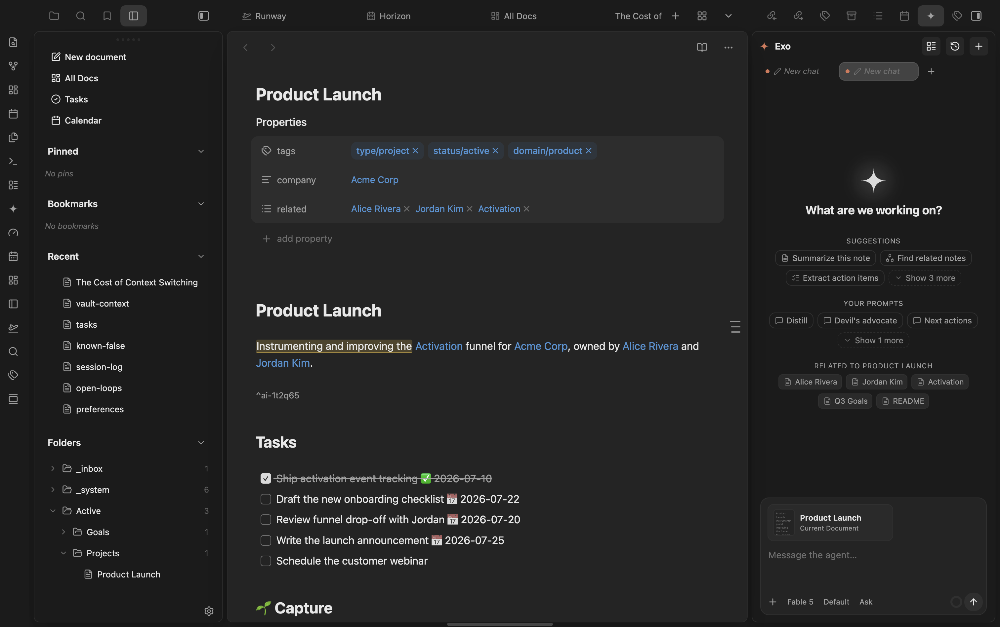

# AIditor

Obsidian plugin. Durable-but-resolvable **margin annotations**, anchored to blocks — a *gloss* is literally a marginal note.

Attach a comment to a specific block in a note **without mutating the block's prose**. The annotation lives with the note durably (survives edits, sync, reopen), can be **resolved** (archived, not deleted), and can be **reopened**. Built for self-review of drafts before publishing, and durable marginalia you reread months later.

Not in scope for MVP: multi-user, threading/replies, AI-generated annotations (only the extension point, see below), a global cross-vault annotation browser, export.

Part of the marioverse Obsidian plugin suite.

<p align="center">
  
</p>
<p align="center"><em>An annotated block, highlighted inline with its block anchor visible below.</em></p>

## Anchoring model

Each annotated block gets an Obsidian block reference, `^ai-<6-char-id>`, inserted on a **standalone line** immediately after the block — never inline (inline `^id` breaks `hr`/table rendering). That block-id is the durable anchor: it lives inside the note file itself, so it survives edits and syncs across devices with zero external state.

As cheap insurance, AIditor **also** stores a text-quote fallback (`quote` + up to 32 chars of `prefix`/`suffix` context, W3C-annotation style). If the `^ai-id` line is ever deleted, the annotation becomes `orphaned` instead of lost — the stored quote lets you re-anchor it to fresh text.

AIditor never touches frontmatter and never uses Obsidian's YAML-rewriting helper (`processFrontMatter`) — that helper is known to mangle wikilinks in properties, so the block-id marker only ever lands as a plain line in the note body.

## Storage

All annotations live in a single central sidecar file:

```
_system/annotations/store.json
```

Rationale: this keeps note frontmatter/body clean (only the tiny `^ai-id` marker lands in the note itself), it's Obsidian-Sync-friendly, and it avoids per-note-rename fragility — annotations are keyed by their own id + block-id, so a note is still re-locatable by searching for its block-id vault-wide even if `notePath` goes stale. Single-user, so last-write-wins is an acceptable model; writes are debounced and read-modify-write the whole file.

## Lifecycle

Every annotation has a `status`:

| Status | Meaning |
|---|---|
| `active` | Shown as a gutter marker in Live Preview + in the panel's Active filter. |
| `resolved` | Hidden from the gutter; visible under the panel's Resolved filter; **reopenable**. |
| `orphaned` | Its anchor block/`^ai-id` no longer exists in the note; hidden from the gutter; shown under the panel's Orphaned filter with the stored quote so it can be **re-anchored** (select new text, rebind) **or deleted**. |

**Resolving archives — it does not delete.** Deletion is only ever explicit, triggered by the Delete action in the popover. Nothing is ever deleted automatically.

## Reading view: Live-Preview-only in the MVP

AIditor's gutter markers and the "+" hover affordance work in **Live Preview only**. `src/reading.ts` registers a `MarkdownPostProcessor` for Reading view, but it is an **intentional no-op stub** for this release — it does not render markers on rendered Reading-view elements.

This is a documented, scoped decision, not a silent gap: reliably matching Obsidian's rendered DOM elements back to block-id'd blocks (across paragraphs, lists, callouts, tables) is fiddly enough that it's better shipped as a deliberate fast-follow than rushed into MVP. See the `TODO` block at the top of `src/reading.ts` for the concrete plan when it's picked up.

## AI extension point

AIditor exposes a public method directly on the plugin instance, mirroring the cross-plugin pattern used by Exo's `askExo`:

```ts
app.plugins.plugins.aiditor.addAnnotation({
  notePath: "Active/Projects/foo.md",
  quote: "the exact text to annotate",
  body: "the annotation text",
});
// → Promise<string>  (the new annotation's id)
```

It locates the quote in the note, stamps a `^ai-id` if the block doesn't already have one, and creates an `active` annotation. This is a stub extension point only — AIditor ships no AI flow, prompt UI, or Exo coupling itself. A future integration (e.g. Exo) can call this to leave AI-authored annotations without any changes to AIditor.

## Development

Package manager: **pnpm**.

```bash
pnpm install       # install dependencies
pnpm dev           # esbuild watch mode
pnpm build         # tsc --noEmit (typecheck) + esbuild production bundle
pnpm test          # node --test over src/**/*.test.ts (pure-core unit tests)
```

`pnpm build` deploys the built `main.js`, `manifest.json`, and `styles.css` into the target vault's plugin folder (configured via `.obsidian-plugin-dir`, or the `OBSIDIAN_PLUGIN_DIR` env var). Building **does not** enable the plugin — after a build, open Obsidian → Settings → Community plugins and enable **AIditor** manually.

## Commands

- **AIditor: Annotate selection** — ships with **no default hotkey**, so it never collides with your existing bindings. Bind one yourself in Settings → Hotkeys → search "AIditor".
- **AIditor: Open annotations panel** — opens the right-sidebar panel showing Active / Resolved / Orphaned annotations for the currently active note.

## Try it

See it running in the [Obsidianverse sample vault](https://github.com/mariomile/obsidianverse-sample-vault), a small, fictional vault with the whole plugin suite pre-configured.

